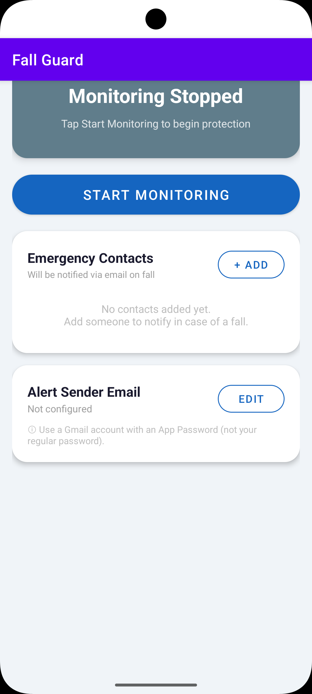

# Fall Guard

**Fall Guard** is an Android application that automatically detects falls using your phone's accelerometer and instantly notifies your emergency contacts via email. Designed for elderly users, athletes, or anyone at risk — it runs silently in the background and acts fast when it matters most.

---

## Screenshot

<p align="center">
  
</p>

---

## Features

- **Automatic Fall Detection** — Uses a 3-phase accelerometer algorithm to accurately detect falls in real time
- **30-Second Cancellation Window** — Gives you time to cancel a false alarm before any alert is sent
- **Email Alerts** — Sends emergency emails to all your configured contacts the moment a fall is confirmed
- **Multiple Emergency Contacts** — Add as many contacts as you need; all of them get notified simultaneously
- **Background Monitoring** — Runs as a foreground service so detection continues even when your screen is off
- **Test Email** — Verify your email setup is working before you rely on it in an emergency

---

## How It Works

Fall Guard uses your phone's accelerometer to watch for three key events in sequence:

1. **Free Fall** — A sudden drop in acceleration (below 6.5 m/s²) indicating the phone is in free fall
2. **Impact** — A sharp spike in acceleration (above 15 m/s²) within 3 seconds, indicating a hard landing
3. **Stillness** — The phone becomes still, confirming the person has not gotten up

If all three phases are detected, Fall Guard triggers an alert. You have **30 seconds** to cancel it. If you do not cancel, emails are sent to all your emergency contacts automatically.

---

## Getting Started

### Prerequisites

- Android 7.0 (API 24) or higher
- A Gmail account to send alerts from
- A Gmail **App Password** (see setup below)

### Installation

1. Clone this repository:
   ```bash
   git clone https://github.com/manojkumarsanam/Fall-Guard.git
   ```
2. Open the project in **Android Studio**
3. Build and run on your device or emulator

---

## Setup Guide

### 1. Configure Your Sender Email

Fall Guard sends alerts using Gmail SMTP. You'll need to generate an **App Password** so the app can send emails on your behalf without using your real Google password.

**To create a Gmail App Password:**
1. Go to your Google Account → **Security**
2. Enable **2-Step Verification** if not already on
3. Go to **Security → App Passwords**
4. Generate a password for "Mail" on "Android device"
5. Copy the 16-character password

In the app:
- Tap **Email Settings**
- Enter your Gmail address and the App Password
- Tap **Test Email** to verify it's working

### 2. Add Emergency Contacts

- Tap **Add Contact** in the Emergency Contacts section
- Enter the contact's name and email address
- Repeat for as many contacts as you need

### 3. Start Monitoring

- Tap **Start Monitoring**
- The status card will turn **green** — Fall Guard is now active in the background
- Keep your phone on you (pocket, armband, etc.)

---

## Permissions

| Permission | Purpose |
|---|---|
| `HIGH_SAMPLING_RATE_SENSORS` | High-frequency accelerometer access for accurate detection |
| `FOREGROUND_SERVICE` | Keep monitoring running in the background |
| `WAKE_LOCK` | Prevent the phone from sleeping during monitoring |
| `INTERNET` | Send emergency emails |
| `POST_NOTIFICATIONS` | Show the persistent monitoring notification |

---

## Tech Stack

- **Language**: Kotlin
- **Min SDK**: 24 (Android 7.0)
- **Target SDK**: 36 (Android 15)
- **Key Libraries**:
  - JavaMail for Android — SMTP email sending
  - Material Design Components — UI components
  - Android Sensor Framework — Accelerometer access
  - Android Foreground Services — Background monitoring

---

## Project Structure

```
app/src/main/java/.../
├── MainActivity.kt          # Main UI and user controls
├── FallDetectionService.kt  # Background service for sensor monitoring
├── ContactsManager.kt       # Manages emergency contacts (SharedPreferences)
└── EmailSender.kt           # Handles Gmail SMTP email alerts
```

---

## License

This project is open source. Feel free to use, modify, and distribute it.

---

## Author

**Manoj Kumar Sanam**  
[GitHub](https://github.com/manojkumarsanam)
